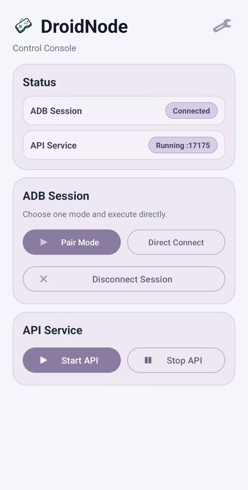
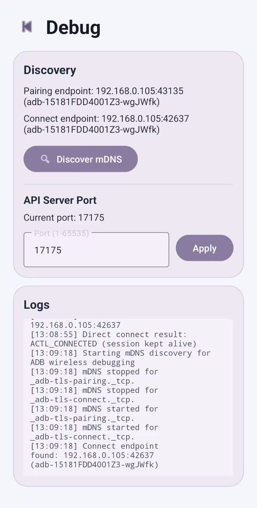

# DroidNode

[中文文档 (Chinese)](./docs/README-CN.md)

<p align="center">
  
</p>

**DroidNode** is a lightweight runtime on Android. It API-enables low-level mobile control capabilities via wireless debugging (ADB over Wi-Fi), turning a phone into an automation node that can be remotely controlled through standard HTTP requests.

Unlike traditional automation frameworks, DroidNode focuses on the **infrastructure layer**. It is not tied to any specific AI model or workflow, and provides stable, standardized primitive operation APIs for LLM/VLM agents, automation testing, and remote device management.

⚠️ Disclaimer & Security Warning

**This project is currently in an AI PoC stage and has not been production-hardened or security-hardened.**

* **No authentication**: the current version does not enforce token verification, and any reachable host in the same LAN may control the device.
* **Public network risk**: never expose the API port directly to the public internet.
* **Legal responsibility**: users must ensure usage complies with local laws and platform policies. The authors are not liable for any loss caused by abuse.


## 🚀 Core Features

* **Fully embedded ADB communication**: inspired by Shizuku, uses `mDNS` for automatic endpoint discovery and supports completing wireless pairing and connection directly on-device, without relying on external PC-side runtime during operation.
* **Embedded API Server**: built on Ktor, listening on port `17171` by default.
* **Primitive controls**: standardized APIs for click, swipe, text input, UI tree capture (XML), and screenshots.
* **Native input enhancement**: built-in `ActlImeService` IME supports UTF-8 injection and improves remote input reliability for focus/text scenarios.
* **Modular architecture**: APIs are registered in a plugin-like modular way, making custom capability extension straightforward.

---

## 🛠 Quick Start

### 1. Environment

* Android 11+ (wireless debugging required).
* Phone and controller must be on the same Wi-Fi network.

### 2. Build and Install

```bash
# Clone repository
git clone https://github.com/your-username/droidnode.git
cd droidnode

# Build with local Gradle
./gradlew :app:assembleDebug

# Install to device
adb install app/build/outputs/apk/debug/app-debug.apk

```

### 3. Activate Node

1. Launch **DroidNode App** on the phone.
2. Go to Developer Options -> Wireless debugging -> Pair device with pairing code.
3. Enter the pairing code in the DroidNode notification action to complete local ADB authorization.
4. Tap **Start API Server**.

---

## 📖 API Overview

Default service endpoint: `http://<device-ip>:17171`

| Path | Method | Description |
| --- | --- | --- |
| `/v1/health` | `GET` | Check node liveness |
| `/v1/system/info` | `GET` | Get device hardware and Android version info |
| `/v1/control/click` | `POST` | Tap, payload: `{"x": int, "y": int}` |
| `/v1/control/swipe` | `POST` | Swipe, payload: `{"startX": int, "startY": int, "endX": int, "endY": int, "durationMs": int}` |
| `/v1/control/input` | `POST` | Text input, payload: `{"text": "...", "pressEnter": bool, "enterAction": "auto/search/send/done/go/next/enter/none"}` |
| `/v1/ui/xml` | `POST` | Get current page UI hierarchy (XML) |
| `/v1/ui/screenshot` | `POST` | Get screenshot (PNG binary stream) |

> **Tip**: for detailed API invocation examples, see [tools/api_tester.sh](./tools/api_tester.sh).

---

## 📊 API Performance Snapshot

Latest benchmark run (2026-02-13):

* Target: `http://192.168.0.105:17175`
* Config: warmup=2, samples=20, timeout=30s
* Result: 140/140 successful requests (100%)

| API | Method | Mean (ms) | P95 (ms) |
| --- | --- | ---: | ---: |
| `/v1/health` | `GET` | 48.35 | 65.26 |
| `/v1/system/info` | `GET` | 113.95 | 125.19 |
| `/v1/control/click` | `POST` | 101.06 | 185.11 |
| `/v1/control/swipe` | `POST` | 211.42 | 224.06 |
| `/v1/control/input` | `POST` | 807.88 | 908.69 |
| `/v1/ui/xml` | `POST` | 2234.79 | 2272.72 |
| `/v1/ui/screenshot` | `POST` | 414.51 | 450.69 |

Detailed report: [`docs/API_PERFORMANCE_REPORT.md`](./docs/API_PERFORMANCE_REPORT.md)

---

## 📂 Project Layout

```text
.
├── app/src/main/java/com/actl/mvp/
│   ├── api/            # Ktor framework and API implementations (v1/)
│   ├── startup/        # mDNS discovery and wireless ADB handshake logic
│   │   └── directadb/  # Pure Kotlin ADB protocol implementation
│   └── ime/            # Custom input method service
├── tools/              # Client-side test scripts (Python/Shell)
└── LICENSE             # Open-source license

```

---

## 🖼 UI Preview

The screenshots below are captured from a real running build.
They show the current MVP UI, including the main control page and the debug page (mDNS discovery, API port configuration, and logs).

<p align="center">
  
  
</p>

---

## 🤝 Roadmap

* [ ] Standardized design
* [ ] Code style and infrastructure setup
* [ ] App-adaptive semantic click APIs
* [ ] Performance optimizations for screenshot and related APIs
* [ ] Token-based request authentication
* [ ] Action Anthropomorphization
* [ ] Native virtual LAN integration based on ZeroTier

Issues and Pull Requests are welcome!
